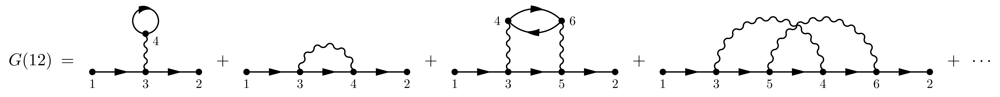
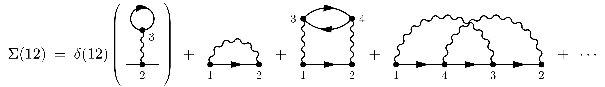

# Feynman Rules

In general, we follow the convention in the textbook "Quantum Many-particle Systems" by J. Negele and H. Orland, Page 95,

## Fourier Transform

```math
G(\tau) = \frac{1}{\beta} \sum_n G(i\omega_n) \text{e}^{-i\omega_n \tau}
```

```math
G(i\omega_n) = \int_0^\beta G(\tau) \text{e}^{i\omega_n \tau} d\tau
```

## Action and Partition Sum
```math
S = \
```

## Bare Propagator

- Imaginary time

```math
g(\tau, \epsilon_k) = \left< \bar{\psi}(k, \tau) \psi(k, 0) \right> \frac{e^{-\epsilon_k \tau}}{1+e^{-\epsilon_k \beta}}
```

- Matusbara frequency

```math
g(i\omega_n, \epsilon_k) = -\frac{1}{i\omega_n-\epsilon_k},
```

## Dressed Propagator and Self-energy

```math
G^{-1} = g^{-1} + \Sigma
```

## Perturbative Expansion of the Green's Function

```math
G = g_{12} + (-1)(-1) g_{13} g_{32} g_{44} v_{44} + (+1) g_{13} g_{34} g_{42} v_{34} + 
```



## Feynman Rules for the Self-energy



## Feynman Rules for the 3-point Vertex Function

## Feynman Rules for the 4-point Vertex Function

## Feynman Rules for the Polarization
